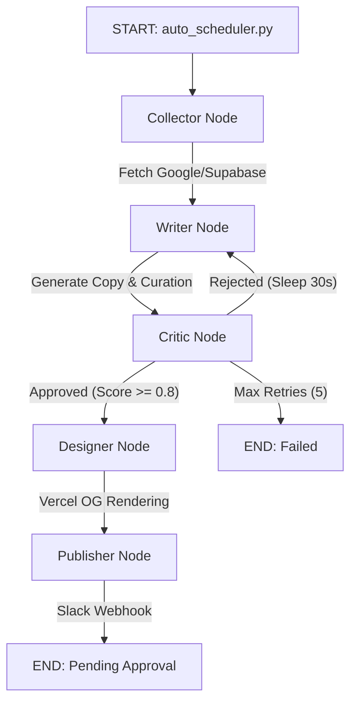

# 🤖 Kkaertalk Auto-Marketing Agents

LangGraph 기반의 완전 자동화 마케팅 콘텐츠 생성 및 발행 파이프라인입니다.
로컬 커뮤니티 데이터(Google Places, Supabase)를 수집하여, AI가 타깃 페르소나에 맞춘 매거진 스타일의 카드뉴스를 제작하고 Slack을 통해 최종 발행 승인을 요청합니다.

## 🌟 Key Features

- **Agentic Workflow (LangGraph):** Writer와 Critic 에이전트가 자체적으로 피드백 루프를 돌며 고품질의 카피를 작성합니다. (최대 5회 재시도, Rate Limit 방어 로직 탑재)
- **Real Photo First:** AI 생성 이미지보다 실제 로컬 핫플 사진을 우선적으로 큐레이션하여 진정성을 확보합니다.
- **High-End Typography:** Vercel OG Engine과 연동하여 동적으로 인스타그램 매거진 스타일의 이미지를 합성합니다.
- **Human-in-the-Loop:** 자동화의 마지막 단계에서 Slack Block Kit UI를 통해 관리자의 최종 승인(Approve) 후 DB에 적재합니다.
- **Serverless Architecture:** Google Cloud Run Jobs와 Cloud Scheduler를 통해 유지비용 없이 정해진 시간에만 구동됩니다.

---

## 🏗️ Architecture Pipeline

이 파이프라인은 `core/graph.py`를 중심으로 5개의 핵심 노드(Node)를 통과합니다.



1. **Collector** (`agents/collector.py`): 마케팅 대상(로컬 핫플)의 리뷰 및 메타데이터, 사진 URL을 수집.
2. **Writer** (`agents/writer.py`): 브랜드 페르소나(Tone & Voice)에 맞춰 3-Slide 캐러셀 카피 및 사진 큐레이션.
3. **Critic** (`agents/critic.py`): 작성된 카피의 진부함(Cliché) 및 가이드라인 준수 여부를 평가. 반려 시 피드백과 함께 Writer로 반환.
4. **Designer** (`agents/designer.py`): 큐레이션된 사진과 텍스트를 Vercel OG Endpoint(`design.sesametalk.us`)에 전달하여 최종 이미지를 렌더링하고 Supabase Storage에 업로드.
5. **Publisher** (`agents/publisher.py`): 최종 산출물을 Slack `#marketing-approval` 채널에 전송하여 인간의 승인 대기.

---

## 📂 Directory Structure

```text
yuunchloe-marketing-agents/
├── agents/                 # LangGraph Node 로직 (collector, writer, critic, designer, publisher)
├── config/                 # 브랜드 페르소나, 타깃 지역, 프롬프트 세팅 (settings.yaml)
├── core/                   # State 정의 및 파이프라인(Graph) 조립 (graph.py)
├── prompts/                # AI 에이전트별 시스템 프롬프트 (writer_prompt.py, 등)
├── auto_scheduler.py       # (CLI) 자동화 파이프라인 트리거 스크립트
├── main.py                 # (CLI) 단일 토픽 수동 실행 스크립트
├── batch_seeding.py        # (Data) 핫플 기본 데이터 및 이미지 수집기
├── deploy_gcp.sh           # GCP Cloud Run Jobs 배포 쉘 스크립트
├── Dockerfile              # 운영 환경 배포용 컨테이너 이미지
└── README.md
```

---

## 🔑 Environment Variables (`.env`)

로컬 테스트 및 GCP 배포를 위해 다음 환경변수 세팅이 필요합니다.

```dotenv
# AI Models
OPENAI_API_KEY="sk-..."
QWEN_API_KEY="sk-..."
QWEN_BASE_URL="https://dashscope-intl.aliyuncs.com/compatible-mode/v1"
REPLICATE_API_TOKEN="r8_..."

# Database & Storage (Supabase)
EXPO_PUBLIC_SUPABASE_URL="https://xxx.supabase.co"
EXPO_PUBLIC_SUPABASE_ANON_KEY="eyJhbG..."
SUPABASE_SERVICE_ROLE_KEY="eyJhbG..."   # [중요] DB Insert 권한을 위한 Master Key

# External Services
SERPAPI_API_KEY="..."
OG_BASE_URL="https://design.sesametalk.us"   # Vercel 디자인 엔진 엔드포인트

# Slack Integration
SLACK_BOT_TOKEN="xoxb-..."
SLACK_APPROVAL_CHANNEL_ID="C0..."

# LangSmith (Tracing & Debugging)
LANGCHAIN_TRACING_V2="true"
LANGCHAIN_API_KEY="lsv2_..."
LANGCHAIN_PROJECT="yuunchloe-marketing-agents"
```

---

## 💻 Local Setup & Testing

**1. 패키지 설치 (`uv` 권장)**

```bash
uv venv
source .venv/bin/activate
uv pip install -r requirements.txt
```

**2. 핫플 기초 데이터 수집 (Seeding)**

```bash
uv run python batch_seeding.py --mode photos
```

**3. 마케팅 파이프라인 단일 실행 (Manual)**

```bash
uv run python main.py "Torrance 떡볶이 로컬 찐맛집 정보"
```

**4. 자동 스케줄러 실행 (Auto Pilot)**

```bash
uv run python auto_scheduler.py
```

---

## 🚀 Deployment (GCP Cloud Run)

이 프로젝트는 24시간 켜져 있는 서버가 아닌, 스케줄러에 의해 트리거되는 **Cloud Run Jobs** 형태로 배포됩니다.

**1. GCP 배포 스크립트 실행**

```bash
chmod +x deploy_gcp.sh
./deploy_gcp.sh
```

**2. 환경변수 세팅**

- GCP 콘솔 → **Cloud Run** → **Jobs** → `kkaetalk-daily-marketing`
- **Variables & Secrets** 탭에서 `.env`와 동일하게 환경변수 등록.
- 특히 DB 쓰기 권한을 위해 `SUPABASE_SERVICE_ROLE_KEY`가 반드시 포함되어야 합니다.

**3. Cloud Scheduler 연결**

- Cloud Run Job 상단의 **[CREATE TRIGGER]** 클릭.
- **Cloud Scheduler** 선택 후 빈도 설정 (예: `0 9 * * *` — 매일 오전 9시).

**4. 클라우드 수동 실행 테스트**

```bash
gcloud run jobs execute kkaetalk-daily-marketing
```

---

## 🛠️ Known Issues & Troubleshooting

### `429 RateLimitError (TPM Exceeded)`

OpenAI 토큰 한도 초과 방지를 위해 `core/graph.py`의 `route_after_critic` 함수 내에 `time.sleep(30)`이 적용되어 있습니다. 여전히 발생할 경우 시간 지연을 늘리거나 OpenAI 계정 Tier(크레딧 충전)를 상향하세요.

### 디자인 결과물이 검은 화면으로 나올 때

구글 이미지 URL의 쿼리 파라미터 파싱 문제일 수 있습니다. `agents/designer.py`에서 `urllib.parse.quote_plus`가 정상 적용되었는지 확인하세요.

### `new row violates row-level security policy`

Supabase DB Insert 거부 에러입니다. Cloud Run 환경변수에 마스터키(`SUPABASE_SERVICE_ROLE_KEY`)가 누락되었는지 확인하세요.
